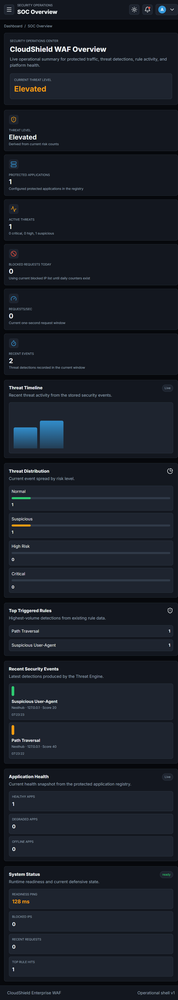
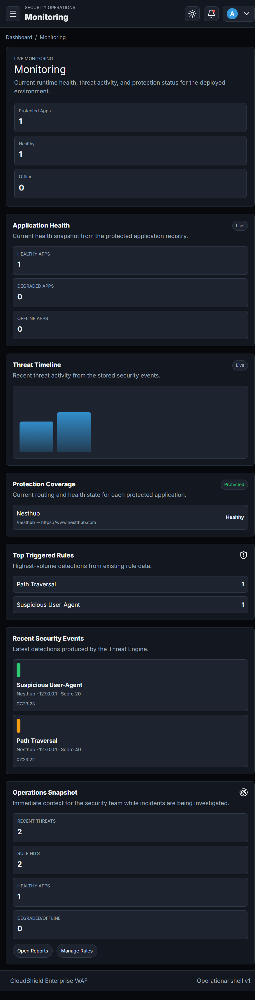
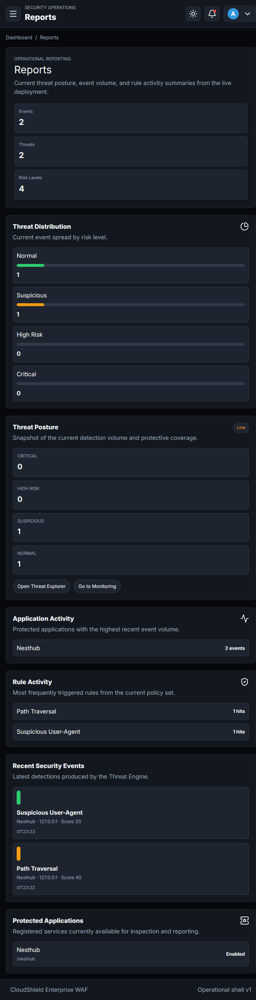
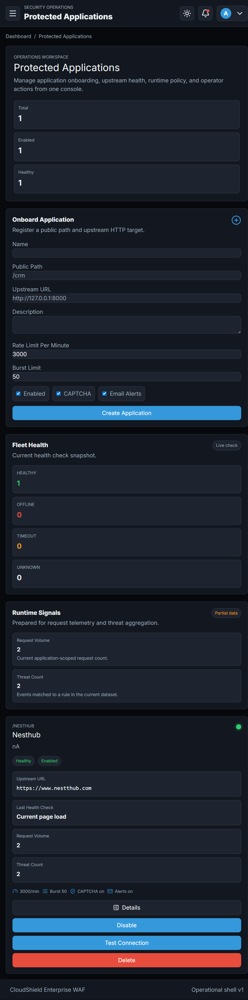

# CloudShield

## Enterprise Multi-Tenant Reverse Proxy Firewall

CloudShield is a Flask-based reverse-proxy firewall that protects HTTP applications without requiring changes to those applications. It receives public traffic, selects a registered protected application by URL path, applies the existing firewall checks, and forwards safe traffic to the selected upstream service.

This milestone introduces the **Multi-Tenant Application Gateway**. CloudShield no longer depends on a single hardcoded upstream application. Administrators can register any HTTP backend, including Flask, Django, Node.js, Laravel, Spring Boot, ASP.NET, Go, or any service reachable over HTTP.

The current milestone adds the **Behavior-Based Threat Detection Engine**. Every matched request is scored before it reaches the upstream backend. CloudShield evaluates request rate, request bursts, user-agent quality, attack paths, payload signatures, path traversal patterns, long URLs, and historical 404/admin-path behavior.

The latest milestone adds **Enterprise Identity & Access Management (IAM)**. CloudShield now supports RBAC, user management, role permissions, audit logs, API keys, JWT access tokens, refresh tokens, login lockout, password policy, and password change flows.

The current milestone adds the **Configurable Rule Engine**. Security detections are now database-backed `SecurityRule` records. Rules execute by priority, contribute to the final threat score, and recommend actions.

## Product Showcase for Interviews

CloudShield is a production-style security platform that I designed and implemented as a full-stack reverse-proxy WAF demo. The admin console gives a strong interview story because it combines architecture, security logic, and user experience in one working product.

### Demo access

Use these credentials to explore the live admin console locally:

- Username: `admin`
- Password: `admin123`

### Screenshots









### What these screens demonstrate

- A real admin dashboard with live security metrics and threat posture summaries.
- Monitoring workflows that surface application health, recent detections, and rule activity.
- Reporting views that make the product feel operational rather than mock-only.
- Protected application onboarding and management for a multi-tenant reverse-proxy flow.

## Current Features

- Dynamic protected-application registry.
- Path-based routing to any HTTP upstream.
- Existing DDoS request-threshold blocking.
- Existing file-backed blocked-IP list.
- Existing CAPTCHA recovery flow for blocked IPs.
- Existing email alert behavior.
- Admin dashboard for traffic/blocklist management.
- Protected Applications admin page for app onboarding and management.
- Lightweight upstream health checks.
- Behavior-based threat scoring before proxy forwarding.
- Risk-based actions: allow, log, CAPTCHA, and temporary block.
- SecurityEvent records for triggered threat rules.
- Admin dashboard threat summaries.
- Enterprise IAM with RBAC roles and configurable permissions.
- JWT access and refresh token authentication for API clients.
- Revocable refresh tokens.
- Hashed API keys with one-time plaintext display.
- Administrative audit logs.
- Opt-in CSRF protection for admin forms.
- Database-backed configurable WAF rules.
- Offline rule tester for evaluating URLs, headers, methods, and query strings.
- Optional Redis-backed runtime security state with in-memory fallback.
- Transparent forwarding of headers, query parameters, request body, and content type.
- SQLAlchemy model foundation.
- Rotating application, security, and error logs.

## Architecture

```text
cloudshield/
    app/
        __init__.py
        routes/
            admin.py
            auth_api.py
            captcha.py
            firewall.py
        services/
            api_key_service.py
            application_registry.py
            blocklist_service.py
            email_service.py
            redis_service.py
            rule_service.py
            rate_limiter.py
            runtime.py
            threat_summary_service.py
        security/
            jwt_service.py
            threat_engine.py
        proxy/
            forwarder.py
        models/
        templates/
        static/
        utils/
    config.py
    extensions.py
    run.py
    app.py
    requirements.txt
    .env.example
    README.md
```

## How Routing Works

Each protected application has a `public_path` and an `upstream_url`.

Example:

```text
Name: CRM
Public path: /crm
Upstream URL: http://127.0.0.1:7001
```

Incoming request:

```text
GET /crm/login
```

CloudShield resolves `/crm`, removes that prefix, and forwards to:

```text
GET http://127.0.0.1:7001/login
```

Nested paths are supported:

```text
Incoming: /cloud/api/users
App public_path: /cloud
Forwarded: http://localhost:8000/api/users
```

CloudShield uses longest-prefix matching, so `/cloud/admin` can be registered separately from `/cloud` if needed.

## How Proxy Forwarding Works

The proxy service supports:

- `GET`
- `POST`
- `PUT`
- `PATCH`
- `DELETE`

CloudShield forwards:

- Headers
- Query parameters
- Raw request body
- Content-Type
- Cookies

It returns the upstream response body, response headers, and status code to the client.

Friendly gateway errors:

- `404`: No matching protected application.
- `502`: Upstream application unavailable.
- `503`: Protected application is disabled.

## Threat Engine

The threat engine lives in `app/security/threat_engine.py`. Each request starts with a score of `0`. Enabled database rules inspect the request in priority order and add points when suspicious behavior is detected.

Default seeded rules:

```text
SQL Injection
XSS
Path Traversal
Sensitive Files
Admin Scanning
Suspicious User-Agent
Long URL
Missing User-Agent
Rate Threshold
```

Common attack paths:

```text
/admin
/phpmyadmin
/.env
/.git
/config
/wp-admin
```

SQL injection signatures include:

```text
UNION SELECT
' OR 1=1
DROP TABLE
```

XSS signatures include:

```text
<script>
javascript:
onerror=
```

Path traversal signatures include:

```text
../
..\
```

## Risk Levels

```text
0-20: Normal
21-40: Suspicious
41-70: High Risk
71+: Critical
```

## Threat Actions

```text
Normal: Allow
Suspicious: Log and allow
High Risk: CAPTCHA
Critical: Temporary block
```

Every triggered rule creates a `SecurityEvent` record with:

- Timestamp
- Application
- IP address
- Threat score
- Matched rule
- Risk level
- Action taken
- Request path

## Threat Configuration

Threat thresholds are environment-driven:

```env
THREAT_WINDOW_SECONDS=60
THREAT_BURST_WINDOW_SECONDS=5
THREAT_TEMP_BLOCK_SECONDS=600
THREAT_LONG_URL_LENGTH=2000
THREAT_404_LIMIT=5
THREAT_ADMIN_PATH_LIMIT=3
THREAT_SUSPICIOUS_USER_AGENTS=sqlmap,nikto,nmap,masscan,acunetix,nessus,dirbuster,hydra
```

## Redis Runtime State

CloudShield can store fast-changing security runtime state in Redis. Redis is optional in development; if it is unavailable, CloudShield logs a warning and continues with in-memory fallback behavior.

Environment variables:

```env
REDIS_HOST=127.0.0.1
REDIS_PORT=6379
REDIS_DB=0
REDIS_PASSWORD=
REDIS_SSL=false
REDIS_SOCKET_TIMEOUT=2
```

Redis-backed state:

```text
Request counters
Rate limiting windows
Threat request windows
Temporary blocks
404 counters
Admin-path counters
CAPTCHA attempt counters
Login attempt counters
```

Key structure:

```text
cloudshield:runtime:rate:events
cloudshield:runtime:threat:req:<ip>
cloudshield:runtime:threat:temp_block:<ip>
cloudshield:runtime:threat:404:<ip>
cloudshield:runtime:threat:admin_path:<ip>
cloudshield:runtime:captcha:attempts:<ip>
cloudshield:runtime:iam:login_attempts:<username>
```

No database migration is required for Redis runtime support.

## Configurable Rule Engine

`SecurityRule` schema:

```text
id
name
description
rule_type
pattern
condition
severity
threat_score
action
priority
enabled
application_id
created_by
created_at
updated_at
```

Supported rule types:

```text
URL Pattern
Regex
Header Match
User-Agent Match
HTTP Method
Request Size
Query String Pattern
```

Supported actions:

```text
Allow
Log
CAPTCHA
Rate Limit
Temporary Block
Permanent Block
```

Rule execution flow:

```text
1. CloudShield resolves the matching ProtectedApplication.
2. Enabled global and app-specific SecurityRule records are loaded.
3. Rules run by ascending priority.
4. Each match contributes threat_score to the request.
5. Matching actions are ranked to choose the strongest recommendation.
6. Risk level is calculated from the final score.
7. SecurityEvent rows are created for triggered rules.
8. The firewall allows, logs, challenges, temporarily blocks, or permanently blocks.
```

Example rule:

```text
Name: Block Env File Probing
Rule Type: URL Pattern
Pattern: /.env
Severity: High
Threat Score: 35
Action: CAPTCHA
Priority: 40
Enabled: true
Application: Global
```

Example evaluation:

```text
Request URL: /crm/.env
Headers: User-Agent: sqlmap
Query String: q=' OR 1=1

Matched:
- SQL Injection: +40
- Sensitive Files: +35
- Suspicious User-Agent: +20

Threat Score: 95
Risk Level: Critical
Recommended Action: Temporary Block
```

Rule management:

```text
/admin/rules
/admin/rules/test
```

The rule tester evaluates pasted URL, headers, method, and query string without sending traffic to any backend.

## Enterprise IAM

CloudShield uses role based access control for administrative access. The initial super admin is seeded from:

```env
ADMIN_USERNAME=admin
ADMIN_EMAIL=admin@cloudshield.local
ADMIN_PASSWORD_HASH=...
```

Roles:

```text
Super Admin
Security Analyst
Operator
Auditor
Viewer
```

Permissions:

```text
manage_users
manage_applications
manage_rules
view_dashboard
view_threats
export_reports
manage_settings
view_audit_logs
manage_api_keys
```

Default permission matrix:

```text
Super Admin: all permissions
Security Analyst: view dashboard, view threats, manage rules, export reports, view audit logs
Operator: view dashboard, manage applications, view threats
Auditor: view dashboard, view threats, export reports, view audit logs
Viewer: view dashboard
```

The role matrix can be adjusted from the admin UI.

## IAM Database Schema

```text
AdminUser
- id
- username
- email
- password_hash
- is_active
- failed_login_attempts
- locked_until
- last_login_at
- password_changed_at
- created_at
- updated_at

Role
- id
- name
- description
- is_system
- created_at
- updated_at

Permission
- id
- code
- name
- description
- created_at

UserRole
- user_id
- role_id
- assigned_at
- assigned_by_id

AuditLog
- id
- user_id
- username
- action
- resource
- ip_address
- status
- message
- created_at

ApiKey
- id
- key_name
- key_prefix
- hashed_key
- created_by_id
- created_at
- expires_at
- status
- purpose

RefreshToken
- id
- user_id
- jti
- token_hash
- issued_at
- expires_at
- revoked_at
- ip_address
- user_agent
```

## Authentication Flow

```text
1. User submits username and password.
2. CloudShield rate-limits login attempts.
3. Account lockout is checked.
4. Password hash is verified with Werkzeug.
5. Successful UI login creates a secure Flask session.
6. Successful API login returns JWT access token and refresh token.
7. Login success or failure is written to AuditLog.
```

Password policy:

```text
Minimum configured length
Uppercase letter
Lowercase letter
Number
Symbol
```

Admin form CSRF protection can be enabled with:

```env
WTF_CSRF_ENABLED=true
```

## Authorization Flow

```text
1. Protected admin route declares a required permission.
2. CloudShield loads the current user from the session.
3. User roles are resolved through UserRole.
4. Role permissions are checked.
5. Request is allowed or a 403 response is returned.
6. Authorization failures are written to AuditLog.
```

Examples:

```text
manage_users: user and role management
manage_applications: protected application management
manage_api_keys: API key generation and revocation
view_audit_logs: audit log access
view_dashboard: dashboard access
```

## JWT Lifecycle

API endpoints:

```text
POST /api/auth/login
POST /api/auth/refresh
POST /api/auth/logout
```

Lifecycle:

```text
1. Login issues a short-lived JWT access token and opaque refresh token.
2. Access token contains user id, username, roles, permissions, jti, iat, exp.
3. Refresh token is stored only as a SHA-256 hash.
4. Refresh rotates the token: old refresh token is revoked, new pair is issued.
5. Logout revokes the supplied refresh token.
```

## API Key Lifecycle

```text
1. Admin creates an API key with name, purpose, status, and optional expiry.
2. CloudShield generates a random key and shows it once.
3. Only SHA-256 hash and prefix are stored.
4. API key can be revoked from the admin UI.
5. Expired or revoked keys are rejected by verification service.
```

## Audit Flow

Administrative actions write `AuditLog` rows:

```text
Login
Logout
Create User
Delete User
Create Protected App
Delete Protected App
Change Role Permissions
Generate API Key
Revoke API Key
Authorization Denied
```

Audit fields:

```text
Timestamp
User
Action
Resource
IP
Status
Message
```

## Protected Application Fields

- `name`
- `description`
- `public_path`
- `upstream_url`
- `enabled`
- `rate_limit_per_minute`
- `burst_limit`
- `captcha_enabled`
- `email_alerts`
- `created_at`
- `updated_at`

## Onboarding A New Protected Application

1. Start the backend application.
2. Log in to CloudShield admin.
3. Open **Protected Applications**.
4. Create an application:

```text
Name: Node API
Public Path: /api
Upstream URL: http://127.0.0.1:3000
Enabled: checked
CAPTCHA Enabled: checked
Email Alerts: checked
```

5. Click **Test** to check upstream health.
6. Visit the public CloudShield URL:

```text
http://127.0.0.1:5000/api/users
```

CloudShield forwards the request to:

```text
http://127.0.0.1:3000/users
```

## Installation

```bash
python -m venv .venv
.venv\Scripts\activate
pip install -r requirements.txt
```

## Configuration

Copy `.env.example` to `.env`.

Generate an admin password hash:

```bash
python -c "from werkzeug.security import generate_password_hash; print(generate_password_hash('your-password'))"
```

Set:

```env
ADMIN_USERNAME=admin
ADMIN_PASSWORD_HASH=your-generated-hash
SECRET_KEY=replace-with-a-long-random-secret
DATABASE_URL=sqlite:///cloudshield.db
```

`UPSTREAM_APP_URL` is no longer used. Upstreams are configured through the Protected Applications admin page.

## Running

Use the failsafe launcher for the most robust startup experience:

```bash
python failsafe_start.py
```

On Windows PowerShell, you can also use:

```powershell
./start.ps1
```

Open:

```text
http://127.0.0.1:5000/admin/login
```

## Docker Runtime

CloudShield can run locally with Docker Compose:

```bash
docker compose up --build
```

Services:

```text
cloudshield - Flask/Gunicorn CloudShield gateway
redis       - Redis runtime store
```

Compose uses:

- Environment-variable configuration.
- Development volume mount for the application source.
- Persistent Redis volume.
- Persistent CloudShield data volume for SQLite/blocklist runtime files.
- Internal bridge network.
- Health checks for CloudShield and Redis.

The application is available at:

```text
http://127.0.0.1:5000
```

## Health Monitoring

CloudShield exposes operational health endpoints:

```text
GET /live
GET /ready
GET /health
```

`/live` reports process liveness:

```json
{
  "status": "alive",
  "application": "CloudShield"
}
```

`/ready` reports readiness for serving traffic:

```json
{
  "status": "ready",
  "components": {
    "database": {"status": "healthy", "connected": true},
    "configuration": {"status": "healthy", "ready": true, "warnings": []},
    "redis": {"status": "healthy", "connected": true, "fallback_enabled": false}
  }
}
```

`/health` reports full component health. Redis fallback is reported as `degraded` but does not fail local development.

## Database Migration Note

For a fresh SQLite database, CloudShield creates the required tables automatically.

If you already have an older `cloudshield.db` from a previous milestone, recreate it during development or add the new nullable `security_events` columns manually:

```sql
ALTER TABLE security_events ADD COLUMN application_id INTEGER;
ALTER TABLE security_events ADD COLUMN application_name VARCHAR(160);
ALTER TABLE security_events ADD COLUMN threat_score INTEGER;
ALTER TABLE security_events ADD COLUMN matched_rule VARCHAR(120);
ALTER TABLE security_events ADD COLUMN risk_level VARCHAR(40);
ALTER TABLE security_events ADD COLUMN action_taken VARCHAR(40);
ALTER TABLE security_events ADD COLUMN request_path VARCHAR(2048);
```

For the Configurable Rule Engine, existing databases also need:

```sql
CREATE TABLE security_rules (
    id INTEGER PRIMARY KEY,
    name VARCHAR(160) NOT NULL,
    description TEXT,
    rule_type VARCHAR(80) NOT NULL,
    pattern TEXT,
    condition TEXT,
    severity VARCHAR(40) NOT NULL,
    threat_score INTEGER NOT NULL,
    action VARCHAR(40) NOT NULL,
    priority INTEGER NOT NULL,
    enabled BOOLEAN NOT NULL,
    application_id INTEGER,
    created_by INTEGER,
    created_at DATETIME NOT NULL,
    updated_at DATETIME NOT NULL
);
```

## Health Status

The Protected Applications page shows:

- `Healthy`: Upstream returned a non-5xx response.
- `Offline`: Upstream could not be reached or returned a server error.
- `Timeout`: Upstream did not respond within the health-check timeout.
- `Unknown`: Health check could not classify the result.

## Example Attack Flow

Request:

```text
GET /crm/.env?q=' OR 1=1
User-Agent: sqlmap
```

Evaluation:

```text
Suspicious User-Agent: +20
Access to common attack paths: +35
SQL Injection patterns: +40
Total Score: 95
Risk Level: Critical
Action: Temporary Block
```

Example SecurityEvent:

```text
Application: CRM
IP: 127.0.0.1
Threat Score: 95
Matched Rule: SQL Injection patterns
Risk Level: Critical
Action Taken: Temporary Block
Request Path: /crm/.env?q=' OR 1=1
```

## Future Roadmap

- Database-backed blocklist and event logging.
- Redis-backed distributed rate limiting.
- Attack scoring and anomaly detection.
- Geo blocking.
- SIEM/webhook integrations.
- Docker and production deployment profile.
- Full CSRF enforcement for admin forms.
